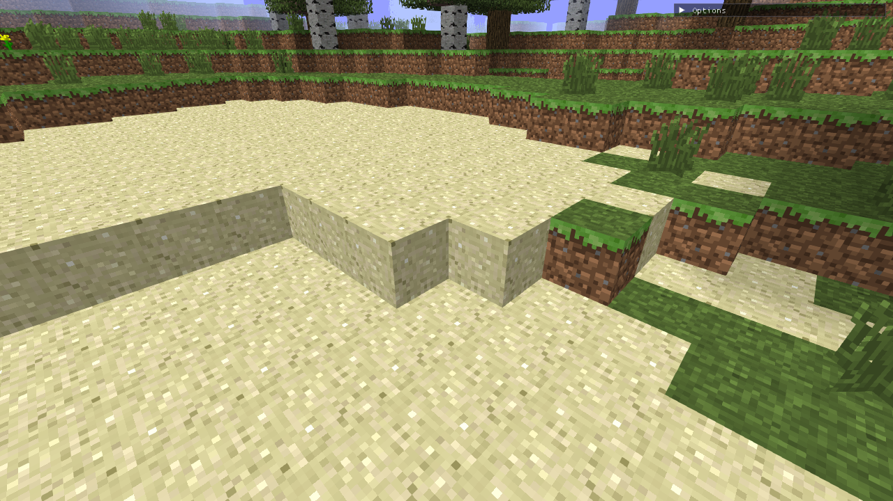

# LegacyWorldViewer


A C++ Application for exploring old Minecraft Worlds,
written to look as close to the real deal as I can manage.

It supports the following level/world formats.
- [Java Edition Indev level format](https://minecraft.wiki/w/Java_Edition_Indev_level_format) ([Indev 20100122](https://minecraft.wiki/w/Java_Edition_Indev_0.31_20100122-2251) - [Indev 20100223](https://minecraft.wiki/w/Java_Edition_Indev_20100223))
- [Java Edition Alpha level format](https://minecraft.wiki/w/Java_Edition_Alpha_level_format) ([Infdev 20100327](https://minecraft.wiki/w/Java_Edition_Infdev_20100327) - [Beta 1.2_02](https://minecraft.wiki/w/Java_Edition_Beta_1.2_02))
- [Region file format](https://minecraft.wiki/w/Region_file_format) ([Beta 1.3](https://minecraft.wiki/w/Java_Edition_Beta_1.3) - [Release 1.1](https://minecraft.wiki/w/Java_Edition_1.1))

While [Release 1.1](https://minecraft.wiki/w/Java_Edition_1.1) Worlds can be loaded, Blocks that were added after [Beta 1.7.3](https://minecraft.wiki/w/Java_Edition_Beta_1.7.3) are not supported.

See the [compatibility section](#compatibility) for more info.

## Screenshot


## Compatibility
Worlds made between [Beta 1.3](https://minecraft.wiki/w/Java_Edition_Beta_1.3) and [Beta 1.7.3](https://minecraft.wiki/w/Java_Edition_Beta_1.7.3) should show up accurately, as these are fully supported and tested.

### Region file format (Beta 1.3 - Release 1.1)
Worlds created between [Beta 1.3](https://minecraft.wiki/w/Java_Edition_Beta_1.3) and [Release 1.1](https://minecraft.wiki/w/Java_Edition_1.1), stored in the [Region file format](https://minecraft.wiki/w/Region_file_format), are mostly supported and will show up correctly.

Currently only blocks up to [Beta 1.7.3](https://minecraft.wiki/w/Java_Edition_Beta_1.7.3) are accessible, so any blocks that were added after [Beta 1.8](https://minecraft.wiki/w/Java_Edition_Beta_1.8) will show up as the generic fallback block.

### Alpha level format (Infdev 20100327 - Beta 1.2_01)
Worlds created between [Alpha v1.0.1](https://minecraft.wiki/w/Java_Edition_Alpha_v1.0.1) and [Beta 1.2_01](https://minecraft.wiki/w/Java_Edition_Beta_1.2_02), stored in the [Java Edition Alpha level format](https://minecraft.wiki/w/Java_Edition_Alpha_level_format), 
will also show up mostly correctly.

#### Before Alpha v1.0.1 (Gears)
Worlds created before [Alpha v1.0.1](https://minecraft.wiki/w/Java_Edition_Alpha_v1.0.1) will have all of their Gears displayed as Redstone dust.

#### Before Infdev 20100624 (Cloth + Liquid Spawners)
This applies to versions before [Infdev 20100624](https://minecraft.wiki/w/Java_Edition_Infdev_20100624) which had access to the old cloth blocks (Id 21 - 36). These will show up as the blocks that took their respective IDs later on.

The same applies to the infinite Lava and Water spawner blocks.

### Indev Level format (Indev 20100122 - Indev 20100223)
Any Indev version before [Infdev 20100227](https://minecraft.wiki/w/Java_Edition_Infdev_20100227-1414) that uses the [Java Edition Indev level format](https://minecraft.wiki/w/Java_Edition_Indev_level_format) should load up, with the exception of levels that exceed `128` blocks in height. Those levels will have their height forcefully capped at `128` blocks, and any blocks above that level will not be rendered.

## Build Instructions
Install the required programs and libraries.

### Setup
#### Debian / Ubuntu / Linux Mint
```bash
sudo apt install git cmake ninja-build g++ libgl1-mesa-dev libglfw3-dev libdeflate-dev libglm-dev libstb-dev libfmt-dev
```
#### RHEL / Fedora
```bash
sudo dnf install git cmake ninja-build gcc-c++ mesa-libGL-devel glfw-devel libdeflate-devel glm-devel fmt-devel
```
#### Arch Linux
```bash
sudo pacman -S git cmake ninja gcc mesa glfw libdeflate glm stb fmt
```

### Clone the repository
```bash
# Setting up the repo
git clone --recurse-submodules https://github.com/OfficialPixelBrush/LegacyWorldViewer.git
cd LegacyWorldViewer
cmake -B build -S.
```

### Building
```bash
cmake --build build --config Debug
```
or 
```bash
cmake --build build --config Release
```

### Running
```bash
cd build
./LegacyWorldViewer glacier
```
Tested on Linux Mint 22.1, Ubuntu 20.04, WSL 2.4.10.0 (Debian 12/13) and Fedora 44.

### (Optional) Packing as AppImage
```bash
chmod +x ./build_appimage.sh
./build_appimage.sh
```

### (Optional) Packing as tar.gz
```bash
cpack --config build/CPackConfig.cmake -G TGZ
```

## Note for adding blocks
When exporting, ensure the exported block meshes are triangulated! Quad Meshes are not handled and **will** break rendering.

## Background
See [Background](BACKGROUND.md), which explains why this project exists.

## Progress
See [TODO](TODO.md)!

## Resources
### Minecraft Wiki
- [Java Edition Indev level format](https://minecraft.wiki/w/Java_Edition_Indev_level_format)
- [Java Edition Alpha level format](https://minecraft.wiki/w/Java_Edition_Alpha_level_format)
- [Region file format](https://minecraft.wiki/w/Region_file_format)
- [NBT format](https://minecraft.wiki/w/NBT_format)
### wiki.vg (Now part of the Minecraft Wiki)
- [Protocol: Chunk Data and Update Light](https://minecraft.wiki/w/Minecraft_Wiki:Projects/wiki.vg_merge/Protocol#Chunk_Data_and_Update_Light)
### YouTube
- ["Why You Shouldn't Nest Your Code" by CodeAesthetic](https://www.youtube.com/watch?v=CFRhGnuXG-4)
- ["OpenGL Course - Create 3D and 2D Graphics With C++" by freeCodeCamp.org](https://youtu.be/45MIykWJ-C4)
### Other
- [Minecraft ID List](https://minecraft-ids.grahamedgecombe.com/)
