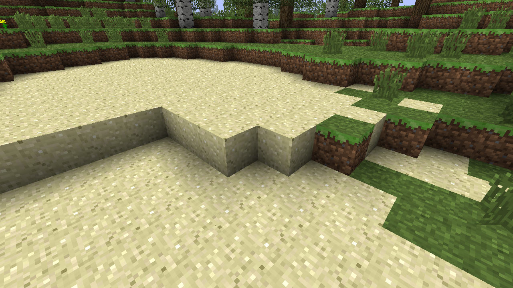

# Betrock
 C++ Application for exploring Minecraft Beta 1.7.3 Worlds

## Screenshot


## Build Instructions
Install the required programs

## Setup
```bash
# Getting utilities
sudo apt install git cmake ninja-build g++
# Getting libraries
sudo apt install libgl1-mesa-dev libglfw3-dev libzip-dev libdeflate-dev libglm-dev libstb-dev

# Setting up the repo
git clone --recurse-submodules https://github.com/OfficialPixelBrush/Betrock.git
cd Betrock
mkdir build
cmake -B build -S.
```

### Compilation
```bash
cmake --build "build" --config Debug --target all
cp ./build/Betrock ./
```

### Running
```bash
./Betrock saves/glacier/
```
Tested on Linux Mint 22 and Ubuntu 20.04

## Background
This project was an idea I had around the middle of 2023 but due to various factors, mainly me being busy with school and work, I was unable to realize it. As I'm unemployed right now, I figured I may as well get busy and learn some proper C++ and finally delve into OpenGL. This project is the result of that.

As a first step, I decided to see how far I could get with Python, to see how difficult it'd be to decypher Minecraft Beta's McRegion file format. Soon enough, I was able to extract the raw block data and dump it into a binary file. I reused the code of an old voxel world gen attempt I made in Godot, and reworked it to accept said binary files. Lo and behold, a chunk was loaded.

The next day I rewrote that code directly in GDScript to load whole McRegion files entirely in Godot, now allowing arbitrary regions to be loaded. However, due to each cube being rendered individually, the performance was rather abysmal. As a result, I figured I'd challenge myself and recreate something like it from scratch in C++ and OpenGL.

The [Python](https://github.com/OfficialPixelBrush/GodotBetaImport/blob/main/mcr.py) and [Godot](https://github.com/OfficialPixelBrush/GodotBetaImport/) experiments of this project are linked here.


## Code Style
### I'm new to C++!
This is moreso a disclaimer. I'm new to C++, so there'll be lots of C-isms as I try to get a proper grip on how C++ works and how to properly work with various OOP-isms. If there's code that looks out of place or outright bad, feel free to give tips as to how to improve it. I'd love to learn more!

### Never Nesting Rules
In an attempt to keep this Code somewhat readable for other people (and for me in the future), I've chosen to employ the **Never Nest** design pattern.

Please refer to the following video as to why: ["Why You Shouldn't Nest Your Code" by CodeAesthetic](https://www.youtube.com/watch?v=CFRhGnuXG-4)


## Progress
### Goals for Version 0.2.0
- Visual Flair
    - [x] Fog
    - [x] Smooth Lighting
- Gameplay
    - [x] Chunk Loading
        - [x] Chunk Queue
        - [x] Fix Chunk Loading Crash
        - [ ] Fix Chunk Loading Memory leak
        - [x]  Threaded Chunk Loading
    - [x] Dynamic Chunk Loading as one moves
    - [x] Gravity
    - [ ] Block Breaking
- [ ] Windows Version
      - stb causing issues here

### Goals for Version 0.1.0
- [x] Import Beta 1.7.3 compliant Minecraft worlds
    - [x] Decode Chunk Offset
    - [x] Decompress Chunk Data
        - [ ] Gzip
        - [x] Zlib
    - [x] Decode NBT Data
    - [x] Turn NBT Data into C++ Objects
    - [x] Extract Block Data
- [x] Render Block Data (via OpenGL)
    - [x] Render *something*
    - [x] Render a Texture
    - [x] Render a Cube
    - [x] Have a Camera that's keyboard and mouse controlled
    - [x] Add Lighting
    - [x] Model Importing
        - [x] OBJ
        - ~~[ ] glTF~~
    - [x] Render a Chunk
    - [x] Render a Region
    - [x] Render Multiple Regions
    - [x] Render per-face Block lighting
        - [x] Render Sky Lighting
        - [x] Render Block Lighting

## Resources
### Minecraft Wiki
- [Region file format](https://minecraft.wiki/w/Region_file_format)
- [NBT format](https://minecraft.wiki/w/NBT_format)
### wiki.vg
- [Protocol: Chunk Data and Update Light](https://wiki.vg/Protocol#Chunk_Data_and_Update_Light)
### YouTube
- ["Why You Shouldn't Nest Your Code" by CodeAesthetic](https://www.youtube.com/watch?v=CFRhGnuXG-4)
- ["OpenGL Course - Create 3D and 2D Graphics With C++" by freeCodeCamp.org](https://youtu.be/45MIykWJ-C4)
